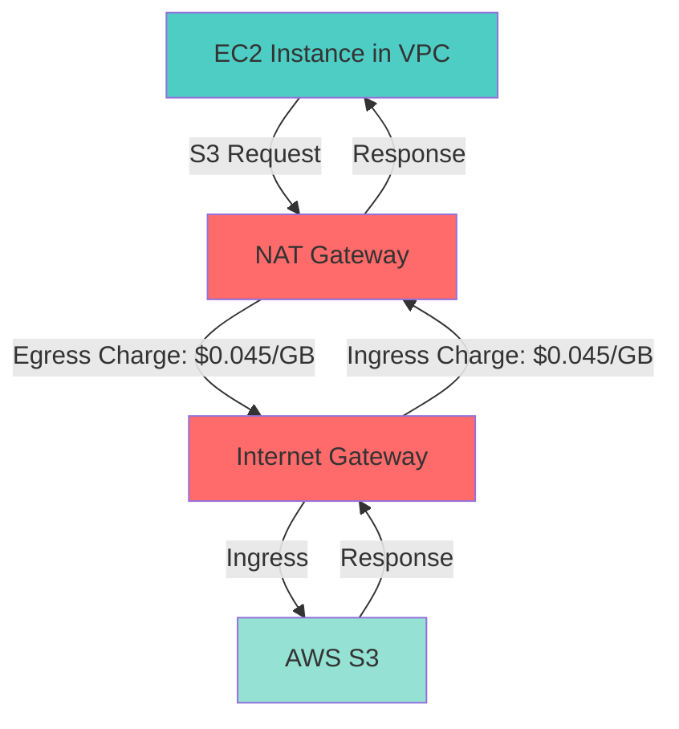
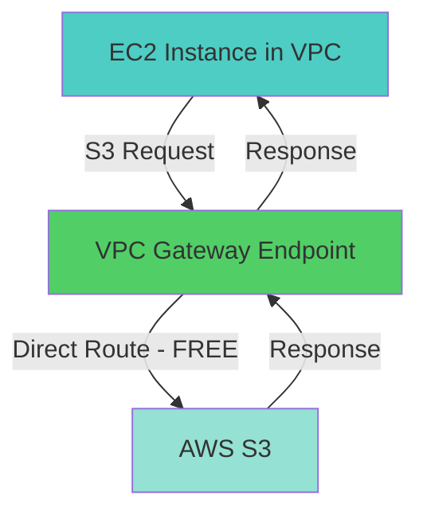
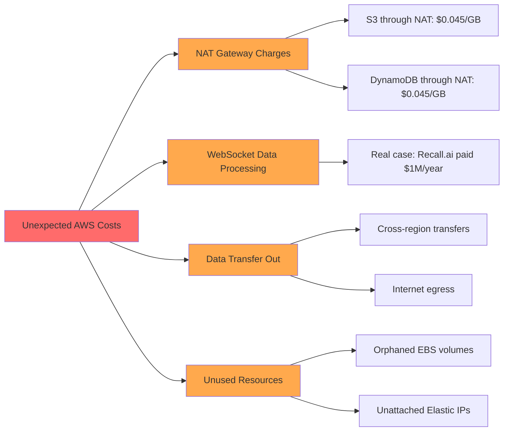
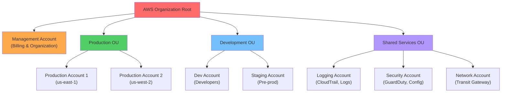
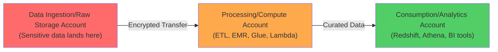
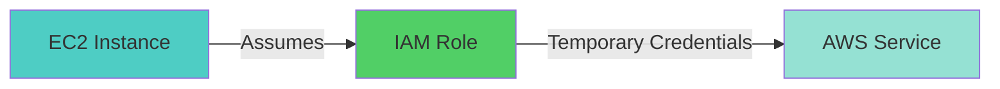

# AWS Infrastructure Best Practices

## The AWS Well-Architected Framework

The most important AWS best practices are built around the **AWS Well-Architected Framework**, which emphasizes **six pillars**:

### 1. Operational Excellence
- Automate deployments with Infrastructure as Code (IaC)
- Use monitoring and logging (CloudWatch, CloudTrail) to track system health
- Regularly review workloads with the Well-Architected Tool
- Implement runbooks and incident response procedures

### 2. Security
- Apply the principle of least privilege with IAM roles and policies
- Enable multi-factor authentication (MFA) for all accounts
- Encrypt data at rest (KMS, S3 encryption) and in transit (TLS)
- Use AWS Organizations and Service Control Policies (SCPs) for governance
- Regularly audit access with Access Analyzer

### 3. Reliability
- Design for fault tolerance with multi-AZ and multi-region deployments
- Implement automated backups and disaster recovery strategies
- Use Elastic Load Balancing and Auto Scaling for resilience
- Test failover scenarios regularly

### 4. Performance Efficiency
- Choose the right instance types and storage options for workloads
- Use caching (CloudFront, ElastiCache) to reduce latency
- Optimize databases with Aurora or DynamoDB depending on workload
- Monitor performance metrics and adjust capacity proactively

### 5. Cost Optimization
- Monitor usage with AWS Cost Explorer and Budgets
- Use Reserved Instances or Savings Plans for predictable workloads
- Right-size resources and shut down unused instances
- Use VPC Endpoints to avoid NAT Gateway charges (see below)

### 6. Sustainability
- Optimize workloads to reduce unnecessary compute cycles
- Use serverless (Lambda, Fargate) to minimize idle resources
- Leverage AWS's renewable energy-powered regions
- Monitor carbon footprint with AWS Carbon Footprint Tool

---

## Implementation Guides

This document covers AWS best practices and architectural patterns organized by the Well-Architected Framework pillars. For concrete implementation examples:

- **Pulumi (TypeScript)**: See [`aws-pulumi.md`](./aws-pulumi.md) — Recommended for TypeScript projects
- **Terraform (HCL)**: See [`aws-terraform.md`](./aws-terraform.md) — Alternative for declarative IaC

Both files contain identical implementations of the patterns described below, allowing you to choose your preferred IaC tool.

---

## VPC Endpoints: Avoiding Unexpected Data Transfer Costs

### The Problem: NAT Gateway Charges for ALL Traffic

When using a NAT Gateway in your VPC (standard for production setups), **all egress traffic is charged**, even when communicating with AWS services in the same region. This includes S3 transfers, which are normally free for in-region communication.

**Cost Impact**: $0.045 per GB of data processed through the NAT Gateway.



**Real-world example**: A team discovered they were paying $1,000+ monthly for S3 transfers that should have been free. The culprit: all traffic routing through the NAT Gateway.

### The Solution: VPC Gateway Endpoints for S3

A **Gateway Endpoint** creates a direct, private route from your VPC to S3, completely bypassing the NAT Gateway and Internet Gateway.

**Cost**: Completely free. No hourly charges, no data transfer charges.



### Implementation

See implementation examples in:
- [`aws-pulumi.md`](./aws-pulumi.md#vpc-gateway-endpoints-for-s3) — Pulumi TypeScript
- [`aws-terraform.md`](./aws-terraform.md#vpc-gateway-endpoints-for-s3) — Terraform HCL

### When to Use Gateway Endpoints

**Use Gateway Endpoints for**:
- S3 (most common use case)
- DynamoDB
- Any VPC with a NAT Gateway that accesses these services

**Why**:
- Completely free
- Improved performance (lower latency)
- Reduced NAT Gateway load
- No data transfer charges

### Audit Checklist

- [ ] Identify all VPCs with NAT Gateways
- [ ] Check if EC2 instances access S3 or DynamoDB
- [ ] Verify Gateway Endpoints exist for these services
- [ ] Confirm route tables are associated with endpoints
- [ ] Monitor CloudWatch metrics for endpoint usage
- [ ] Review VPC Flow Logs to confirm traffic routing

---

## Cost Optimization Rules

### Rule 1: Enable AWS Cost Anomaly Detection

**Why**: Catches unexpected cost spikes within days, not at month-end. The NAT Gateway issue described above was caught within days by anomaly detection, preventing a much larger surprise at month-end.

#### Setup: AWS Console (Manual)

1. **Navigate to Billing Console**
   - Go to AWS Management Console
   - Search for "Billing" or navigate to `https://console.aws.amazon.com/billing/`

2. **Enable Cost Anomaly Detection**
   - In the left sidebar, click **Cost Anomaly Detection**
   - Click **Create Monitor**
   - Choose scope:
     - **All AWS services** (recommended for initial setup)
     - Or select specific services (e.g., EC2, S3, NAT Gateway)

3. **Configure Detection Sensitivity**
   - **Detection frequency**: Daily (default, recommended)
   - **Sensitivity**: 
     - `Low` (catches 50%+ increases) — fewer false positives
     - `Medium` (catches 25%+ increases) — balanced
     - `High` (catches 10%+ increases) — most sensitive, recommended for production

4. **Set Up Notifications**
   - Choose notification method:
     - **SNS Topic** (recommended for automation)
     - **Email** (for manual review)
   - If using SNS:
     - Create or select an existing SNS topic
     - Subscribe your email or Slack webhook to the topic
     - Verify subscription in your email

5. **Review and Create**
   - Click **Create Monitor**
   - Verify the monitor appears in your Cost Anomaly Detection dashboard

#### Setup: Infrastructure as Code

See implementation examples in:
- [`aws-pulumi.md`](./aws-pulumi.md#cost-anomaly-detection-setup) — Pulumi TypeScript
- [`aws-terraform.md`](./aws-terraform.md#cost-anomaly-detection-setup) — Terraform HCL

#### Setup: AWS CLI

```bash
# Create SNS topic
SNS_TOPIC_ARN=$(aws sns create-topic \
  --name aws-cost-anomaly-alerts \
  --query 'TopicArn' \
  --output text)

# Subscribe email
aws sns subscribe \
  --topic-arn "$SNS_TOPIC_ARN" \
  --protocol email \
  --notification-endpoint "your-email@example.com"

# Create anomaly monitor
MONITOR_ARN=$(aws ce create-anomaly-monitor \
  --anomaly-monitor '{
    "MonitorName": "all-services-monitor",
    "MonitorType": "DIMENSIONAL",
    "MonitorDimension": "SERVICE"
  }' \
  --query 'MonitorArn' \
  --output text)

# Create anomaly subscription (alert)
aws ce create-anomaly-subscription \
  --anomaly-subscription '{
    "SubscriptionName": "all-services-alert",
    "Threshold": 100,
    "Frequency": "DAILY",
    "MonitorArnList": ["'"$MONITOR_ARN"'"],
    "SNSTopicArn": "'"$SNS_TOPIC_ARN"'"
  }'

echo "Cost Anomaly Detection configured!"
echo "SNS Topic: $SNS_TOPIC_ARN"
echo "Check your email for SNS subscription confirmation"
```

#### Alert Response Workflow

When you receive a cost anomaly alert:

1. **Acknowledge receipt** — Confirm you received the alert
2. **Investigate immediately**
   - Go to Cost Explorer in AWS Console
   - Filter by the service mentioned in the alert
   - Check the time range of the spike
   - Identify the root cause (e.g., NAT Gateway, data transfer, new resources)
3. **Take action**
   - If it's a misconfiguration (like NAT Gateway routing), fix it immediately
   - If it's expected (e.g., new data pipeline), document it
   - If it's a mistake, terminate the resources
4. **Document findings**
   - Add a note to your infrastructure runbook
   - Update cost forecasts if needed
   - Share learnings with the team

#### Expected Benefit

Early warning system that caught the $1,000+ NAT Gateway issue within days, preventing a much larger surprise at month-end.

### Rule 2: Validate Assumptions with Small-Scale Testing

**Anti-pattern**: Assuming "EC2 to S3 is free" without testing.

**Pattern**:
1. Test with a small amount of data (e.g., 1 GB)
2. Monitor actual costs for 24-48 hours
3. Extrapolate to production scale
4. Verify assumptions before scaling to terabytes

**Example**: Before migrating 100 TB of data, test with 1 TB and monitor costs.

### Rule 3: Audit Infrastructure Regularly

**Cadence**: Quarterly or after major infrastructure changes.

**Checklist**:
- [ ] Review all VPC configurations
- [ ] Verify Gateway Endpoints for S3/DynamoDB
- [ ] Check NAT Gateway usage and costs
- [ ] Audit unused resources (EBS volumes, Elastic IPs, etc.)
- [ ] Review data transfer costs by service
- [ ] Validate security group and NACLs

---

## Common AWS Cost Surprises



### Known Gotchas

- **NAT Gateway charges for ALL protocols**: Not just HTTP/HTTPS. Includes DNS, NTP, etc.
- **Data transfer is directional**: Ingress is often free, but egress is charged.
- **AWS services aren't always "free" from EC2**: Only if you bypass the NAT Gateway.
- **Regional differences**: Costs vary by region; always check your region's pricing.

---

## Recommended Resources

- [AWS VPC Endpoints Documentation](https://docs.aws.amazon.com/vpc/latest/privatelink/vpc-endpoints.html)
- [AWS Cost Anomaly Detection](https://docs.aws.amazon.com/cost-management/latest/userguide/anomaly-detection.html)
- [AWS NAT Gateway Pricing](https://aws.amazon.com/vpc/pricing/)
- [Save Cash by Avoiding The AWS NAT Gateway with Gateway Endpoints](https://www.carmencincotti.com/blog/github/aws/terraform/2024/03/11/save-cash-by-avoiding-the-aws-nat-gateway-with-gateway-endpoints/) by Carmen Cincotti
- [The AWS Managed NAT Gateway is Unpleasant and Not Recommended](https://www.lastweekinaws.com/blog/the-aws-managed-nat-gateway-is-unpleasant-and-not-recommended/) by Corey Quinn
- [Cloudflare's Take on AWS Egress Costs](https://blog.cloudflare.com/aws-egress-costs/)

---

## AWS Resource Tagging Strategy

### Why Tagging Matters

Tags are the foundation of cost allocation, automation, and governance. Without consistent tagging, you cannot:
- Track costs by department, project, or environment
- Enforce compliance policies
- Automate resource lifecycle management
- Audit who created/owns resources
- Implement proper access controls

### Tagging Taxonomy

For implementation examples, see:
- [`aws-pulumi.md`](./aws-pulumi.md#resource-tagging) — Pulumi TypeScript
- [`aws-terraform.md`](./aws-terraform.md#resource-tagging) — Terraform HCL

```mermaid
graph TD
    Tags["AWS Resource Tags"]
    
    Tags --> Technical["Technical Tags"]
    Tags --> Business["Business Tags"]
    Tags --> Governance["Governance Tags"]
    Tags --> Lineage["Lineage Tags"]
    
    Technical --> T1["Purpose: Reporting, Core, Ingest, Export, Transient, Custom, Adhoc"]
    Technical --> T2["App: Application name"]
    Technical --> T3["Service: Service name"]
    Technical --> T4["Version: Semantic version"]
    Technical --> T5["Environment: dev, staging, prod"]
    Technical --> T6["SLA: Service level agreement"]
    Technical --> T7["DeployingIndividual: Who deployed"]
    Technical --> T8["DeployingDepartment: Which team deployed"]
    Technical --> T9["Pattern: Template/pattern used"]
    
    Business --> B1["RequestingDepartmentManager: Manager name"]
    Business --> B2["RequestingIndividual: Who requested"]
    Business --> B3["RequestingDepartment: Which team requested"]
    Business --> B4["Product: Product identity"]
    
    Governance --> G1["PIILevel: None, Low, Medium, High"]
    Governance --> G2["ComplianceRequired: SOC2, PCI-DSS, HIPAA, etc"]
    Governance --> G3["SecurityClassification: Public, Internal, Confidential, Secret"]
    Governance --> G4["RetireDate: YYYY-MM-DD"]
    Governance --> G5["CostCenter: Cost code for billing"]
    Governance --> G6["Tenancy: Client/project identifier"]
    
    Lineage --> L1["Upstreams: Dependent resources"]
    Lineage --> L2["Downstreams: Resources that depend on this"]
    
    style Tags fill:#ff6b6b
    style Technical fill:#4ecdc4
    style Business fill:#74c0fc
    style Governance fill:#b197fc
    style Lineage fill:#ffa94d
```




### Tag Validation Rules

**Mandatory Tags** (all resources):
- `Environment` (dev, staging, prod)
- `App` (application name)
- `CostCenter` (billing code)
- `ComplianceRequired` (if applicable)
- `SecurityClassification` (Public, Internal, Confidential, Secret)

**Conditional Tags**:
- If `PIILevel` is High/Medium → `ComplianceRequired` must include SOC2
- If `Environment` is prod → `SLA` must be defined
- If `PIILevel` is High → `SecurityClassification` must be Confidential or Secret

**Tag Value Standards**:
- Use kebab-case for multi-word values (e.g., `cost-center-001`)
- Use ISO 8601 dates (YYYY-MM-DD)
- Use semantic versioning (MAJOR.MINOR.PATCH)
- Avoid special characters except hyphens and underscores

### Auditing Tags

See implementation examples in:
- [`aws-pulumi.md`](./aws-pulumi.md#tag-enforcement-with-aws-config) — Pulumi TypeScript
- [`aws-terraform.md`](./aws-terraform.md#auditing-tags-with-access-analyzer) — Terraform HCL

---

## AWS Account Hierarchy & Multi-Account Strategy

### Why Multi-Account Architecture?

A single AWS account is a security and operational risk. Multi-account architecture provides:

- **Blast radius containment** — Issues in one account don't affect others
- **Billing isolation** — Track costs per team, project, or environment
- **Security boundaries** — Separate credentials, permissions, and audit trails
- **Compliance** — Meet regulatory requirements (PCI-DSS, HIPAA, SOC 2)
- **Scalability** — AWS service quotas are per-account; multi-account avoids limits



### Core Concepts: AWS Organizations

**What it is**: AWS Organizations allows you to centrally manage and govern multiple AWS accounts.

**Key Components**:

- **Management Account** (formerly "Master" or "Payer" account)
  - Responsible for paying bills for all linked accounts
  - Manages the Organization structure
  - **Insight**: Centralizes billing—no separate credit cards for every project
  - **Never run workloads here** — use only for organization management

- **Member Accounts**
  - All other accounts linked to the Management Account
  - **Insight**: AWS Account is the most fundamental security and isolation boundary
  - Each account has its own service quotas, credentials, and audit trails

- **Organizational Units (OUs)**
  - Logical groupings of accounts (think of them as folders)
  - Allow you to apply rules to entire groups at once
  - **Insight**: Service Control Policies (SCPs) on an OU prevent expensive mistakes across all accounts in that OU

### Recommended Account Structure

**Management Account** (1 account):
- AWS Organization management
- Consolidated billing
- Cross-account role assumption
- **Never run workloads here** — use only for organization management

**Production OU** (2+ accounts):
- Production Account (primary workloads)
- Production Account (disaster recovery / secondary region)
- Separate by region or criticality

**Development OU** (2+ accounts):
- Development Account (active development)
- Staging Account (pre-production testing)
- **SCP Example**: Prevent expensive services (e.g., no p3 GPU instances, no multi-AZ RDS by default)

**Shared Services OU** (3+ accounts):
- **Logging Account** — Centralized CloudTrail, VPC Flow Logs, application logs
- **Security Account** — GuardDuty, AWS Config, Security Hub, vulnerability scanning
- **Network Account** — Transit Gateway, DNS (Route 53), VPN endpoints

**Infrastructure OU** (optional):
- Shared infrastructure services
- Networking, DNS, certificate management

**Security OU** (optional):
- Dedicated security tooling
- Centralized monitoring and compliance

### Implementation

See implementation examples in:
- [`aws-pulumi.md`](./aws-pulumi.md#aws-organizations-setup) — Pulumi TypeScript
- [`aws-terraform.md`](./aws-terraform.md#aws-organizations-setup) — Terraform HCL

---

## Data Processing Account Architecture

For data-intensive workloads, AWS Organizations enables a specialized account structure that provides **blast radius reduction** and **clear cost attribution** across the data lifecycle.

### Data Processing Account Pattern



### Account Responsibilities

**Data Ingestion/Raw Storage Account**:
- Raw, potentially sensitive data lands here first
- Minimal compute; focus on secure storage
- S3 buckets with encryption at rest and in transit
- Restricted access (only ingestion processes and processing account)
- High PII level tagging
- **Cost**: Storage costs (relatively predictable)

**Processing/Compute Account**:
- Main ETL/data pipeline runs here (EMR, Glue, Lambda, Spark)
- Heavy lifting and transformations happen here
- Temporary compute resources that scale up/down
- Reads from Ingestion account, writes to Consumption account
- **Cost**: Compute costs (variable, highest cost account)

**Consumption/Analytics Account**:
- End-users access curated, processed data
- Redshift clusters, Athena queries, BI tools
- Read-only access to processed data
- No access to raw data
- **Cost**: Query and analytics costs

### Benefits of This Architecture

| Benefit | How It Helps |
|---------|-------------|
| **Blast Radius Reduction** | Configuration error in Compute account doesn't impact raw data or analytics |
| **Clear Cost Attribution** | Know exactly which part of the pipeline costs the most |
| **Security Isolation** | Raw data never exposed to end-users; compute can't access Consumption account |
| **Compliance** | Easier to audit and enforce PII handling in Ingestion account |
| **Service Quotas** | Each account has independent quotas (e.g., Glue jobs, Lambda concurrency) |
| **Team Separation** | Data engineers in Compute, analysts in Consumption, security in Ingestion |

### Implementation

See implementation examples in:
- [`aws-pulumi.md`](./aws-pulumi.md#data-processing-accounts) — Pulumi TypeScript
- [`aws-terraform.md`](./aws-terraform.md#data-processing-accounts) — Terraform HCL

### Key Insight for Newbies

By separating data processing into three accounts, you achieve:
- **Blast radius reduction**: A misconfiguration in the compute account won't expose raw data or break analytics
- **Clear cost attribution**: You instantly know which part of the data lifecycle costs the most money
- **Security by design**: Raw data stays isolated, end-users never see sensitive information
- **Compliance simplification**: Easier to audit and enforce PII handling policies

---

## IAM Best Practices

### Rule 1: Never Use Root Account

**Anti-pattern**: Using root account credentials for daily work.

**Pattern**:
- Root account: Enable MFA, store credentials in secure vault, use only for account recovery
- Create IAM users/roles for all human access
- Use temporary credentials (STS) for programmatic access

### Rule 2: Use IAM Roles, Not Users (for Applications)

**Anti-pattern**: Creating IAM users with long-lived access keys for applications.



**Pattern**: Use IAM roles with temporary credentials (auto-rotated every 15 minutes).

See implementation examples in:
- [`aws-pulumi.md`](./aws-pulumi.md#ec2-instance-with-iam-role) — Pulumi TypeScript
- [`aws-terraform.md`](./aws-terraform.md#ec2-instance-with-iam-role) — Terraform HCL

### Rule 3: Principle of Least Privilege (PoLP)

**Anti-pattern**: `"Action": "*"` and `"Resource": "*"` in IAM policies.

**Pattern**: Grant only the specific actions and resources needed.

See implementation examples in:
- [`aws-pulumi.md`](./aws-pulumi.md#iam-best-practices) — Pulumi TypeScript
- [`aws-terraform.md`](./aws-terraform.md#iam-best-practices) — Terraform HCL

### Rule 4: Use Permission Boundaries

Permission boundaries prevent privilege escalation by setting a maximum permission level.

See implementation examples in:
- [`aws-pulumi.md`](./aws-pulumi.md#permission-boundaries) — Pulumi TypeScript
- [`aws-terraform.md`](./aws-terraform.md#permission-boundaries) — Terraform HCL

### Rule 5: Enable MFA for All Human Users

**Requirement**: Multi-factor authentication for all IAM users with console access.

See implementation examples in:
- [`aws-pulumi.md`](./aws-pulumi.md#mfa-requirement) — Pulumi TypeScript
- [`aws-terraform.md`](./aws-terraform.md#mfa-requirement) — Terraform HCL

### Rule 6: Audit IAM with Access Analyzer

See implementation examples in:
- [`aws-pulumi.md`](./aws-pulumi.md#access-analyzer) — Pulumi TypeScript
- [`aws-terraform.md`](./aws-terraform.md#access-analyzer) — Terraform HCL

---

## Cross-Account Access Pattern

### Assume Role from Another Account

See implementation examples in:
- [`aws-pulumi.md`](./aws-pulumi.md#cross-account-access) — Pulumi TypeScript
- [`aws-terraform.md`](./aws-terraform.md#cross-account-access) — Terraform HCL

---

## Monitoring & Compliance

### Rule 1: Enable CloudTrail in All Accounts

See implementation examples in:
- [`aws-pulumi.md`](./aws-pulumi.md#cloudtrail) — Pulumi TypeScript
- [`aws-terraform.md`](./aws-terraform.md#cloudtrail) — Terraform HCL

### Rule 2: Enable AWS Config

See implementation examples in:
- [`aws-pulumi.md`](./aws-pulumi.md#aws-config) — Pulumi TypeScript
- [`aws-terraform.md`](./aws-terraform.md#aws-config) — Terraform HCL

### Rule 3: Enable GuardDuty

See implementation examples in:
- [`aws-pulumi.md`](./aws-pulumi.md#guardduty) — Pulumi TypeScript
- [`aws-terraform.md`](./aws-terraform.md#guardduty) — Terraform HCL

---

## Service-Specific Best Practices

### Amazon EC2

- **Patch and update operating systems regularly** — Use Systems Manager Patch Manager for automated patching
- **Use Amazon Inspector** — Scan for vulnerabilities and compliance issues
- **Apply strict security group rules** — Default deny, explicitly allow only required ports
- **Use IAM roles instead of access keys** — Credentials auto-rotate every 15 minutes
- **Enable detailed monitoring** — CloudWatch metrics for performance tracking
- **Use Auto Scaling** — Automatically adjust capacity based on demand

### AWS Organizations

- **Configure multiple policy types**:
  - Service Control Policies (SCPs) — Prevent dangerous actions
  - Backup Policies — Enforce backup requirements
  - Tagging Policies — Enforce consistent tagging
- **Delegate administrators** — Grant specific services to designated accounts
- **Integrate with 30+ AWS services** — Centralized governance across your environment
- **Enable CloudTrail organization trail** — Audit logs from all accounts in one place

### Architectural Patterns

- **Adopt microservices or serverless** — For scalability and reduced operational overhead
- **Use three-tier architectures** — Web tier, application tier, database tier for separation of concerns
- **Implement multi-account strategies** — For isolation, compliance, and cost attribution
- **Design for fault tolerance** — Multi-AZ deployments, automated failover, health checks
- **Use managed services** — RDS, DynamoDB, Lambda reduce operational burden

---

## Key Takeaways

### Networking & Cost
1. **VPC Endpoints are mandatory** for any VPC with a NAT Gateway that accesses S3 or DynamoDB
2. **They're completely free** — there's no reason not to use them
3. **Test assumptions at scale** before deploying to production
4. **Enable cost monitoring** to catch surprises early
5. **AWS networking is complex** — regular audits are essential

### Account Architecture
6. **Use multi-account architecture** — Never run production workloads in a single account
7. **Separate by function** — Management, Production, Development, and Shared Services accounts
8. **Use AWS Organizations** — Centralize billing, enforce policies, and manage accounts at scale
9. **Service Control Policies (SCPs)** — Prevent dangerous actions across all accounts

### IAM Security
10. **Never use root account** — Enable MFA, lock it away, use only for account recovery
11. **Use IAM roles for applications** — Not long-lived access keys; credentials auto-rotate every 15 minutes
12. **Principle of Least Privilege (PoLP)** — Grant only the specific actions and resources needed
13. **Permission boundaries** — Prevent privilege escalation by setting maximum permission levels
14. **MFA for all humans** — Require multi-factor authentication for console access

### Monitoring & Compliance
15. **Enable CloudTrail** — Centralized audit logs in a dedicated Logging account
16. **Enable AWS Config** — Track configuration changes and compliance
17. **Enable GuardDuty** — Threat detection with machine learning
18. **Access Analyzer** — Audit IAM policies for unintended external access

### Well-Architected Framework
19. **Start with the six pillars** — Operational Excellence, Security, Reliability, Performance Efficiency, Cost Optimization, Sustainability
20. **Layer in service-specific practices** — As workloads grow, add EC2 hardening, Organizations governance, architectural patterns
21. **Use the Well-Architected Tool** — Regularly review workloads against the framework
22. **Balance all pillars** — Don't optimize for cost at the expense of security or reliability

---

## Getting Started

If you're starting out with AWS:

1. **Focus first on the Well-Architected Framework pillars** — Understand the six pillars and how they apply to your workloads
2. **Implement the foundational practices** — Multi-account architecture, IAM, monitoring, cost controls
3. **Layer in service-specific practices** — As your workloads grow, add EC2 security hardening, Organizations governance, architectural patterns
4. **Ensure your cloud environment remains secure, efficient, and cost-effective** — Regular audits and reviews

The difference between a $100 monthly bill and a $1,000+ surprise often comes down to understanding networking details and cost optimization. The difference between a secure AWS environment and a compromised one comes down to proper account structure, IAM policies, and monitoring.
