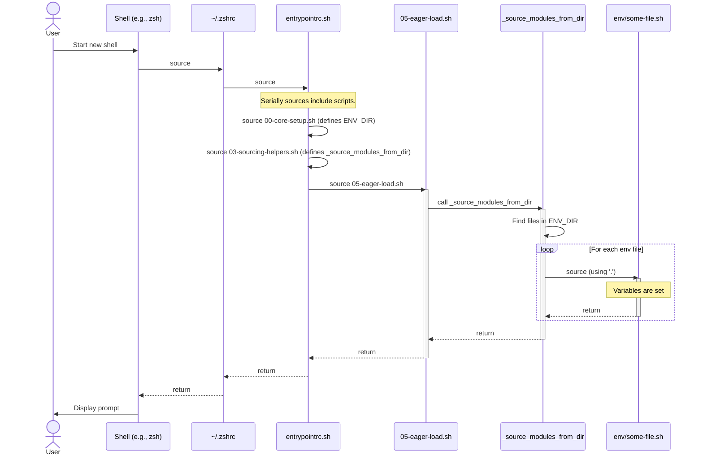

# Shell Environment Sourcing Critical Path

This document outlines the critical path for sourcing shell environment files (`shells/env/*`) and analyzes the potential for sub-shell issues that might prevent variables from being exported to the login shell.

## Mermaid Diagram: Sourcing Flow

## Textual Explanation of the Critical Path

1.  **Initiation (`entrypointrc.sh`)**: The process begins when your shell's rc file (e.g., `.zshrc`) sources `entrypointrc.sh`.

2.  **Core Setup (`00-core-setup.sh`)**: This script is sourced first. It defines the crucial `ENV_DIR` variable, which points to `.../shells/shared/env`.

3.  **Sourcing Helpers (`03-sourcing-helpers.sh`)**: This script defines the `_source_modules_from_dir` function, which is the workhorse for sourcing all files within a given directory.

4.  **Eager Loading (`05-eager-load.sh`)**: This script is responsible for eagerly loading essential modules. It calls `_source_modules_from_dir` and passes the `$ENV_DIR` variable to it, instructing it to source all `.sh`, `.bash`, and `.env` files found there.

5.  **Execution (`_source_modules_from_dir`)**: This function iterates through each file in the `ENV_DIR`. For each file, it uses `enhanced_safe_source`, which in turn uses the `.` command (the POSIX-compliant version of `source`). This command executes the script's content directly within the **current shell's context**.

## Sub-shell Analysis

The modular design correctly avoids the creation of sub-shells for sourcing environment files:

-   **No Pipelines on `while read`**: The `while read` loop in `_source_modules_from_dir` uses input redirection from a temporary file (`< file`) rather than a pipeline (e.g., `find ... | while read ...`). This ensures the loop itself does not run in a sub-shell.
-   **Use of `.` (source)**: The use of the `.` built-in command is the correct way to load variables into the current shell. It does not spawn a new process.

Given this analysis, if environment variables from the `shells/env` directory are not present in your login shell, the cause is not due to a sub-shell being created by the sourcing framework. The problem is more likely to be found in:

-   **The content of the `.env` files**: An `exit` command or a command that fails with `set -e` could terminate the script prematurely.
-   **Permissions**: The files must be readable by the user.
-   **Shell-specific behavior**: A subtle difference in how shells handle sourcing or variable scope could be at play, although the current implementation is POSIX-compliant and should be robust.
